# Booking Attractions

A data importer that processes Booking.com Attractions datasets and loads them into a database, using streaming/batch/parallel processing. The project contains **four parallel, independent pipelines** that do the same job into different storage backends, built so the team can compare them:

1. **Postgres pipeline** — Django ORM + `psqlextra`, writes into a partitioned PostgreSQL/PostGIS schema.
2. **Iceberg pipeline** — PySpark, writes into local filesystem-backed Apache Iceberg tables via a Hadoop catalog.
3. **Elasticsearch pipeline** — plain Python + `ijson`, writes into local Elasticsearch indices via Docker.
4. **DynamoDB pipeline** — plain Python + `boto3`, writes into local DynamoDB tables via Docker.

All three pipelines read the exact same source files under `data/` and populate the same logical entities (attractions, localized content, photos, reviews, review scores, price history, skipped/unmatched records) — just into different targets.


## Tech Stack

* Python 3.12+
* Django ORM
* PostgreSQL 16 + PostGIS 3.4
* PySpark 3.5.4 + Apache Iceberg (Spark runtime jar 1.6.1, Scala 2.12)
* Elasticsearch 8.x
* DynamoDB (via amazon/dynamodb-local) + boto3
* Docker & Docker Compose
* ijson


## Project Structure

```text
booking_attraction/
├── apps/
│   └── attractions/
│       ├── management/
│       │   └── commands/
│       │       ├── import_attractions.py
│       │       ├── import_attractions_iceberg.py
│       │       ├── import_attractions_elasticsearch.py
│       │       └── import_attractions_dynamodb.py
│       ├── migrations/
│       ├── models.py
│       ├── services.py
│       ├── db_services.py
│       ├── apps.py
│       └── __init__.py
│
├── core/
│   ├── utils/
│   ├── app_config.toml.example
│   ├── configuration.py
│   ├── settings.py
│   └── ...
│
├── pyspark_etl/
│   ├── config.py
│   ├── session.py
│   ├── pipeline.py
│   ├── services.py
│   ├── catalog/
│   ├── schemas/
│   ├── readers/
│   ├── transforms/
│   ├── writers/
│   └── spark_pipeline_data/
│       └── warehouse/          # local Iceberg warehouse (generated at runtime)
│
├── elasticsearch_etl/
│   ├── config.py
│   ├── client.py
│   ├── services.py
│   ├── pipeline.py
│   ├── indices/
│   │   ├── mappings.py
│   │   └── index_manager.py
│   ├── readers/
│   │   ├── json_reader.py
│   │   └── location_mapping_reader.py
│   └── transforms/
│       ├── slug.py
│       ├── rental_property.py
│       ├── property_reviews.py
│       └── price_history.py
│
├── dynamodb_etl/
│   ├── config.py
│   ├── client.py
│   ├── services.py
│   ├── pipeline.py
│   ├── tables/
│   │   ├── schemas.py
│   │   ├── table_manager.py
│   │   ├── schema_fields.py
│   │   └── schema_aligner.py
│   └── transforms/
│       ├── rental_property.py
│       ├── property_reviews.py
│       └── price_history.py
│
├── data/
│   ├── attraction_details/
│   ├── reviews/
│   ├── reviews_scores/
│   ├── search/
│   └── static/
│       └── location_mapping/
│
├── docker/
│   └── django/
│       └── Dockerfile
│
├── docker-compose.yml
├── manage.py
├── requirements.txt
├── README.md
└── .gitignore
```


## Setup

Clone the repository:

```bash
git clone https://github.com/sabbirhosen44/Booking-Attractions.git
cd Booking-Attractions
```

Copy the configuration file:

```bash
cp core/app_config.toml.example core/app_config.toml
```

Build and start containers:

```bash
docker compose build
docker compose up -d
```

Run migrations (Postgres pipeline only):

```bash
docker compose exec web python manage.py migrate
```

> Note: if the `attractions` app has changes to partitioned models, use `python manage.py pgmakemigrations` instead of `makemigrations` — plain `makemigrations` generates a non-partitioned table for `PostgresPartitionedModel` subclasses.


## Data Directory

Place the Booking.com JSON files inside:

```text
data/
├── attraction_details/<date>/changed/*.json
├── reviews/<date>/changed/*.json
├── reviews_scores/<date>/changed/*.json
├── search/<date>/changed/*.json
└── static/
    └── location_mapping/
        └── <country_code>/
            ├── city.json
            ├── district.json
            ├── landmark.json
            └── region.json
```

This same folder feeds all four pipelines.


---

# Postgres Pipeline

## Run

```bash
docker compose exec web python manage.py import_attractions
```

Processes, in order: attraction details → localized content → photos → reviews → review score breakdowns → price/date snapshots. Reviews and search records referencing an attraction not yet imported are logged to `SkipProperties` rather than failing the run.


---

# Iceberg / PySpark Pipeline

## Configuration

`core/app_config.toml` needs an `[iceberg]` section:

```toml
[iceberg]
warehouse_dir = "spark_pipeline_data/warehouse"
catalog_name = "booking"
database = "attractions"
```

> `warehouse_dir` is resolved **relative to the `pyspark_etl/` package folder**, not the project root — so with the value above, the actual warehouse ends up at `pyspark_etl/spark_pipeline_data/warehouse/`.

## Run

```bash
docker compose exec web python manage.py import_attractions_iceberg
```

Runs the same import logic against Apache Iceberg tables (local filesystem storage, Hadoop catalog) instead of PostgreSQL. Can run independently of, and without interfering with, the Postgres pipeline — both read from the same `data/` folder but write to entirely separate storage. Each Iceberg table mirrors the full column set of its corresponding Django model, not just the fields this importer populates.

## Schema changes

If `pyspark_etl/catalog/schema_defs.py` changes (columns added/removed), existing Iceberg tables do **not** auto-migrate. Delete the warehouse and re-run from scratch:

```bash
docker compose exec web rm -rf /app/pyspark_etl/spark_pipeline_data
docker compose exec web python manage.py import_attractions_iceberg
```

Run the delete **inside the container**, not on the host — files created by Spark inside the container are often owned by root, so deleting them directly from the host shell can fail with `Permission denied`.

## Troubleshooting: `ValidationException: Found conflicting files`

If a run fails partway through with an Iceberg `ValidationException` about conflicting files during a `MERGE INTO`, it almost always means the warehouse still has leftover data from a previous partial/failed run. Clear it and re-run clean using the commands above rather than re-running on top of a partial warehouse.

## Inspecting data with Jupyter Notebook

Since Iceberg data is stored as partitioned Parquet files, the most reliable way to inspect it is to query it back through Spark rather than opening `.parquet` files directly.

**1. Make sure `requirements.txt` includes:**

```
jupyter
pandas>=2.0
pyarrow>=14.0
setuptools
```

* `jupyter` — the notebook server itself
* `pandas` — needed for `.toPandas()` to render Spark results as a table
* `pyarrow` — required alongside pandas for Spark ↔ pandas conversion
* `setuptools` — replaces Python's removed `distutils` module, which `pyspark` still imports internally on Python 3.12+

Then rebuild:

```bash
docker compose build web
docker compose up -d
```

**2. Launch the notebook server inside the running container:**

```bash
docker compose exec web jupyter notebook --ip=0.0.0.0 --port=8888 --no-browser --allow-root
```

Copy the printed URL (including `?token=...`) into your browser. Requires port `8888` mapped in `docker-compose.yml` under the `web` service.

**3. Quick session-only install** (if `requirements.txt` hasn't been rebuilt yet), in a notebook cell:

```python
!pip install pandas pyarrow setuptools
```

Then **Kernel → Restart Kernel**.

**4. Query a table:**

```python
import pandas as pd
pd.set_option('display.max_columns', None)
pd.set_option('display.width', None)

from pyspark_etl.session import SparkSessionFactory
spark = SparkSessionFactory.create()

result = spark.sql("SELECT * FROM booking.attractions.rental_property LIMIT 20")
pdf = result.toPandas()
pdf
```

Swap `rental_property` for any other table: `rental_property_localize`, `property_image_meta`, `property_reviews`, `price_history`, `skip_properties`.

```python
# Filter by country_code
spark.sql("SELECT * FROM booking.attractions.rental_property WHERE country_code = 'de' LIMIT 20").toPandas()

# List all country codes and row counts
spark.sql("SELECT country_code, COUNT(*) as count FROM booking.attractions.rental_property GROUP BY country_code ORDER BY count DESC").toPandas()
```

> Note: on child tables (`property_reviews`, `price_history`, `rental_property_localize`, `property_image_meta`, `skip_properties`), the `id` column will always show as `NaN`/`NULL` — Iceberg has no autoincrement to populate it. Use the table's actual foreign-key column (e.g. `property_id`) to identify rows instead.

## Screenshots

Sample table output viewed via Jupyter Notebook as described above. Images stored in `static/`.

| Table | Preview |
|---|---|
| `rental_property` | 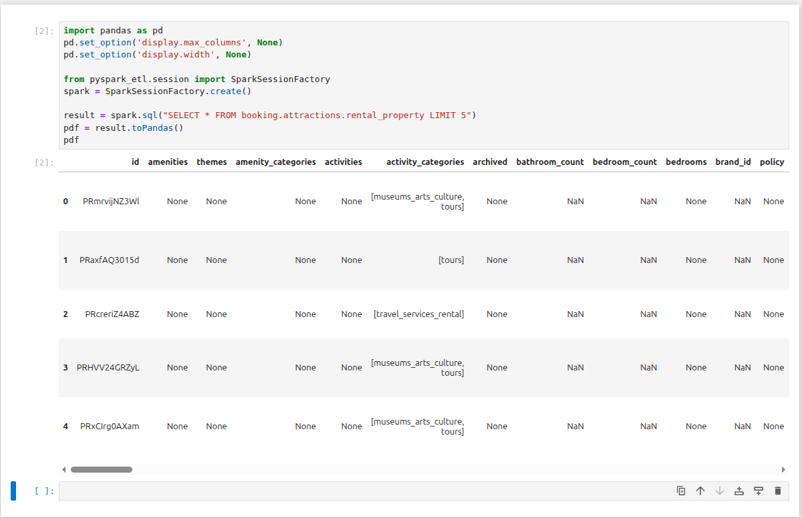 |
| `rental_property_localize` | 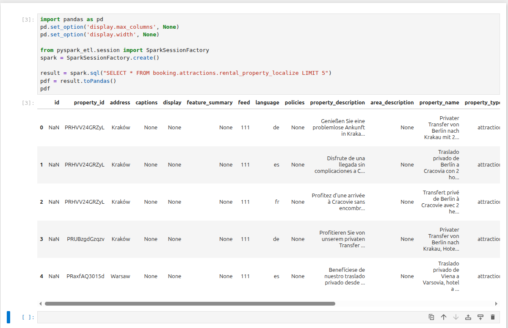 |
| `property_image_meta` | 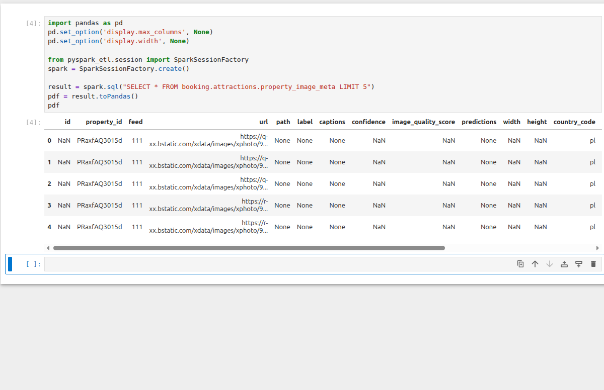 |
| `property_reviews` | 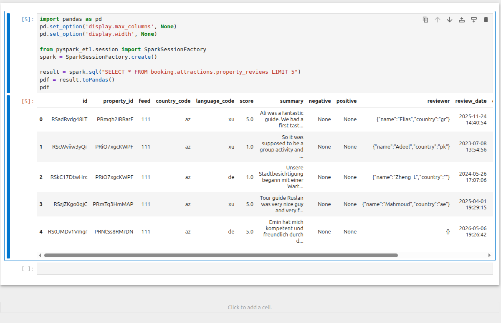 |
| `price_history` | 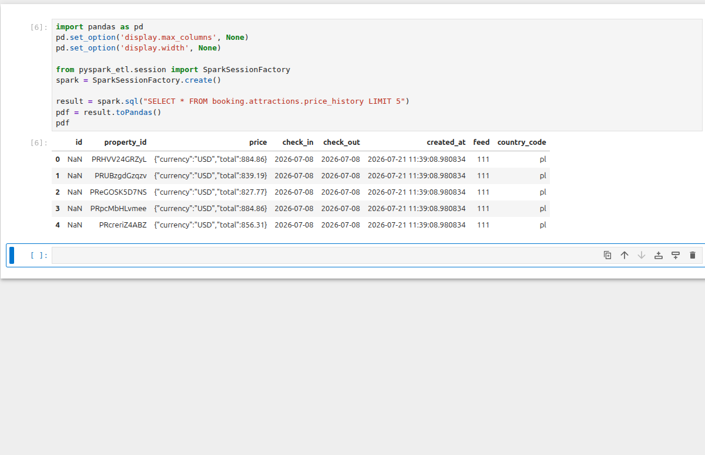 |
| `skip_properties` | 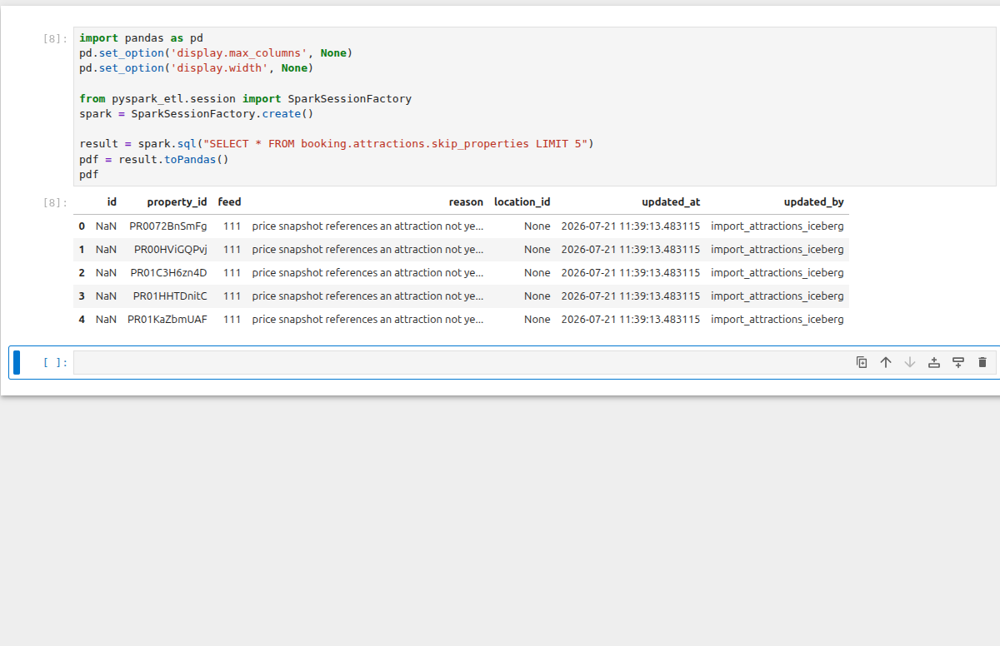 |


---

# Elasticsearch Pipeline

Runs entirely on local Docker — no AWS account or cloud credentials involved.

## Run

```bash
docker compose exec web python manage.py import_attractions_elasticsearch
```

Indices are created automatically on first run, named exactly after each table (no prefix): `rental_property`, `rental_property_localize`, `property_image_meta`, `property_reviews`, `price_history`, `skip_properties`.

Each index mirrors the full field set of its corresponding Django model, same rule as the Iceberg pipeline. `rental_property` and `property_reviews` have real ids and are indexed with `_id` set explicitly, so re-running the importer overwrites existing docs. Child tables with no real id (`rental_property_localize`, `property_image_meta`, `price_history`, `skip_properties`) get ES-generated ids, so re-running creates new docs rather than updating existing ones — same documented gap as the Iceberg pipeline's un-populated auto `id` column.

## Querying data

List all indices and their doc counts:

```bash
docker compose exec elasticsearch curl "localhost:9200/_cat/indices?v"
```

Fetch sample documents from a table:

```bash
curl "localhost:9200/rental_property/_search?size=5"
```

Filter by country code:

```bash
curl -X GET "localhost:9200/rental_property/_search" -H "Content-Type: application/json" -d '{
  "query": { "term": { "country_code": "de" } }
}'
```

Count documents per country code:

```bash
curl -X GET "localhost:9200/rental_property/_search" -H "Content-Type: application/json" -d '{
  "size": 0,
  "aggs": { "by_country": { "terms": { "field": "country_code", "size": 50 } } }
}'
```

Swap `rental_property` for any other index name to query that table instead.

## Schema changes

If `elasticsearch_etl/indices/mappings.py` changes (fields added/removed/retyped), existing indices do **not** auto-migrate — an already-created index keeps its old mapping, and indexing a document with a changed field type will throw a `mapper_parsing_exception`. Delete the index and re-run from scratch after any mapping change.

## Troubleshooting: deleting indices

`DELETE index_name_*` (wildcard delete) is blocked by default — Elasticsearch's `action.destructive_requires_name` setting is `true` out of the box and silently rejects wildcard deletes.

Delete indices explicitly by name instead:

```bash
docker compose exec elasticsearch curl -X DELETE "localhost:9200/rental_property,rental_property_localize,property_image_meta,property_reviews,price_history,skip_properties"
```

Or, to allow wildcard deletes going forward (be careful — this is destructive with no undo):

```bash
docker compose exec elasticsearch curl -X PUT "localhost:9200/_cluster/settings" -H "Content-Type: application/json" -d '{"persistent": {"action.destructive_requires_name": false}}'
```

## Screenshots

Sample query output from each index. Images stored in `static/elasticsearch/`.

| Table | Preview |
|---|---|
| Indices overview | 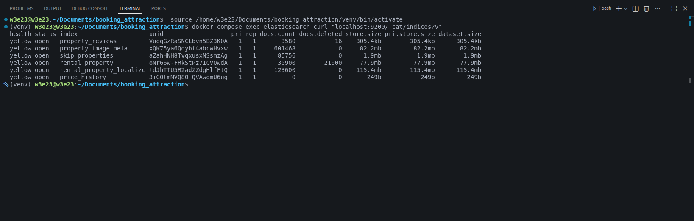 |
| `rental_property` | 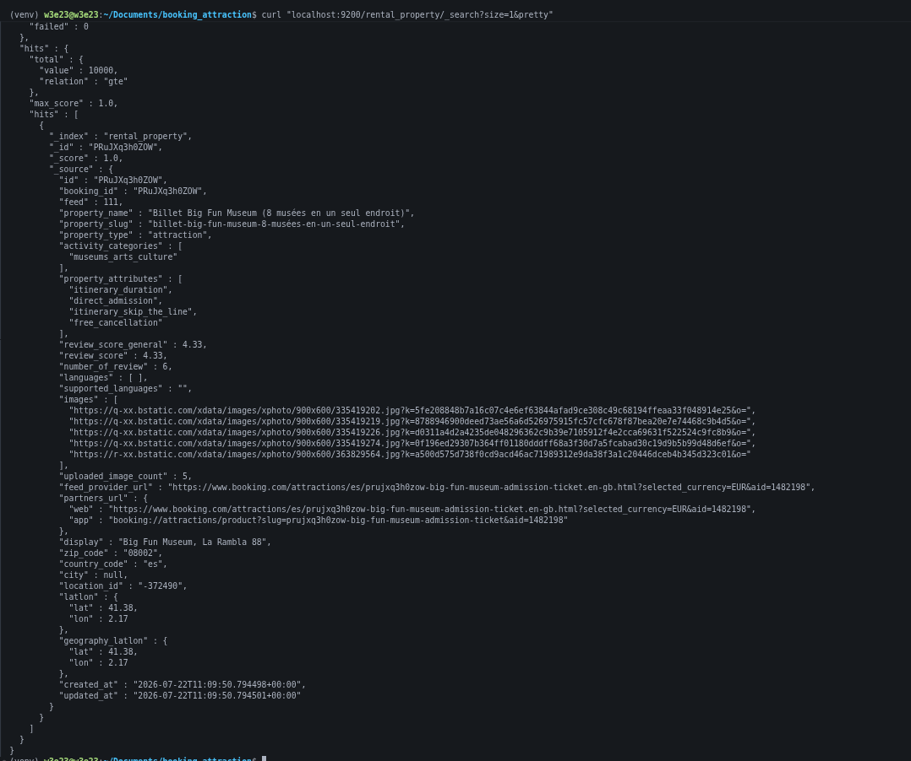 |
| `rental_property_localize` | 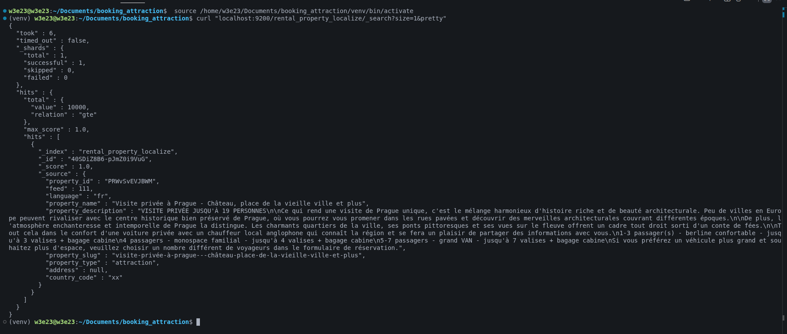 |
| `property_image_meta` | 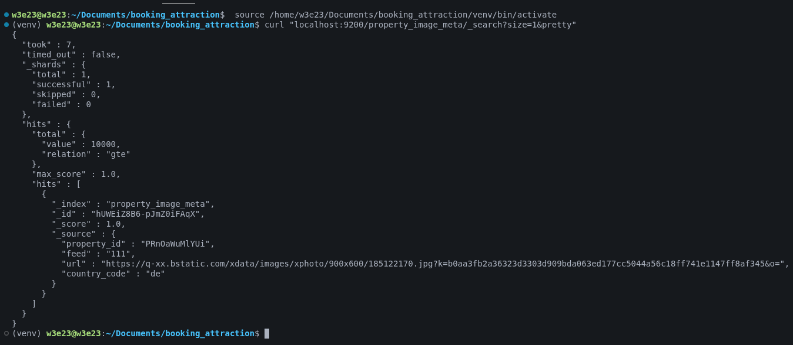 |
| `property_reviews` | 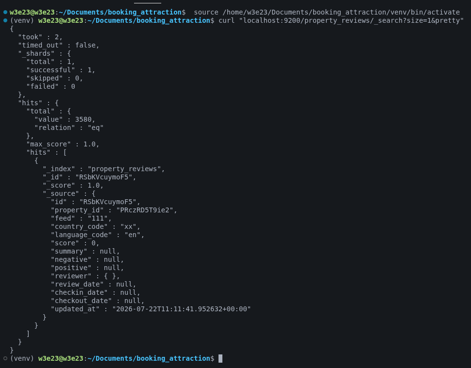 |
| `price_history` | 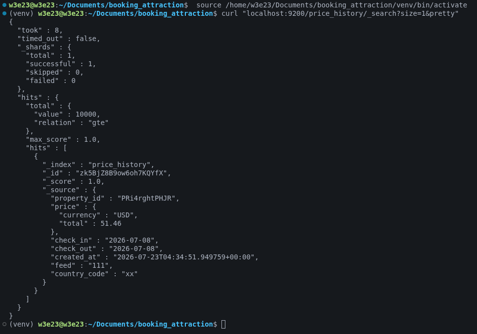 |
| `skip_properties` | 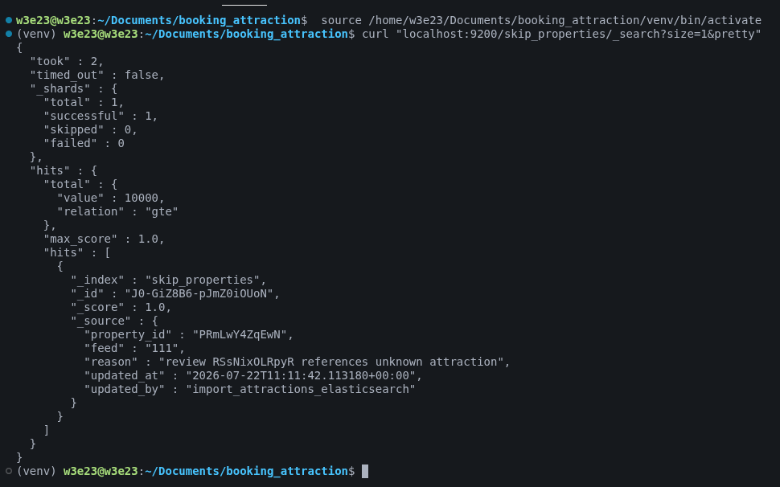 |


---

# DynamoDB Pipeline

Runs entirely on local Docker via `amazon/dynamodb-local` — no AWS account or cloud credentials involved.

## Run

```bash
docker compose exec web python manage.py import_attractions_dynamodb
```

Tables are created automatically on first run. Since DynamoDB requires an explicit partition key (and sometimes a sort key) per table, unlike Elasticsearch, the key design is:

| Table | Partition key | Sort key |
|---|---|---|
| `rental_property` | `id` | — |
| `rental_property_localize` | `property_id` | `language_country_code` |
| `property_image_meta` | `property_id` | `url` |
| `property_reviews` | `id` | — |
| `price_history` | `property_id` | `created_at` |
| `skip_properties` | `property_id` | — |

Every item is padded to the full field set of its corresponding Django model before writing (missing fields stored as `NULL`), same rule as the Iceberg and Elasticsearch pipelines. Tables with a real id (`rental_property`, `property_reviews`) or a `unique=True` field (`skip_properties`) overwrite on re-run; the rest accumulate new items per unique key combination.

## Querying data

Check table item counts:

```bash
docker compose exec web python manage.py shell -c "
from dynamodb_etl.client import DynamoClient
for t in DynamoClient.get().tables.all():
    t.reload()
    print(t.name, '-> item_count:', t.item_count)
"
```

Fetch a sample item from a table:

```bash
docker compose exec web python manage.py shell -c "
import json
from dynamodb_etl.client import DynamoClient
items = DynamoClient.get().Table('rental_property').scan(Limit=1)['Items']
print(json.dumps(items, indent=2, default=str))
"
```

Swap `'rental_property'` for any other table name to check that one instead.

## Schema changes

If `dynamodb_etl/tables/schemas.py` or `schema_fields.py` changes, existing tables do **not** auto-migrate — DynamoDB has no schema to migrate for non-key attributes, but a key schema change requires deleting and recreating the table. Delete the affected table and re-run:

```bash
docker compose exec web python -c "
from dynamodb_etl.client import DynamoClient
DynamoClient.get().Table('TABLE_NAME_HERE').delete()
"
docker compose exec web python manage.py import_attractions_dynamodb
```

## Screenshots

Sample query output from each table. Images stored in `static/dynamodb/`.

| Table | Preview |
|---|---|
| Tables overview | 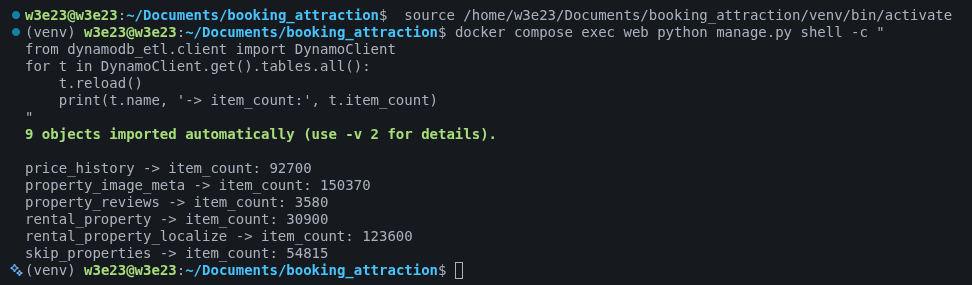 |
| `rental_property` | 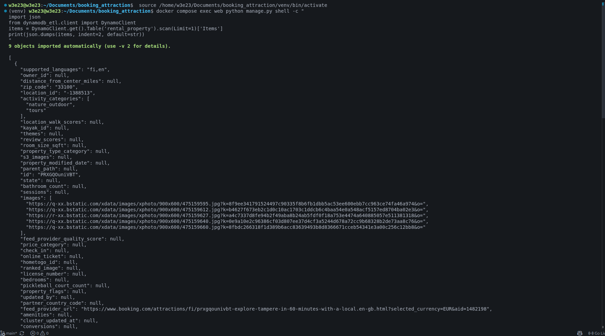 |
| `rental_property_localize` | 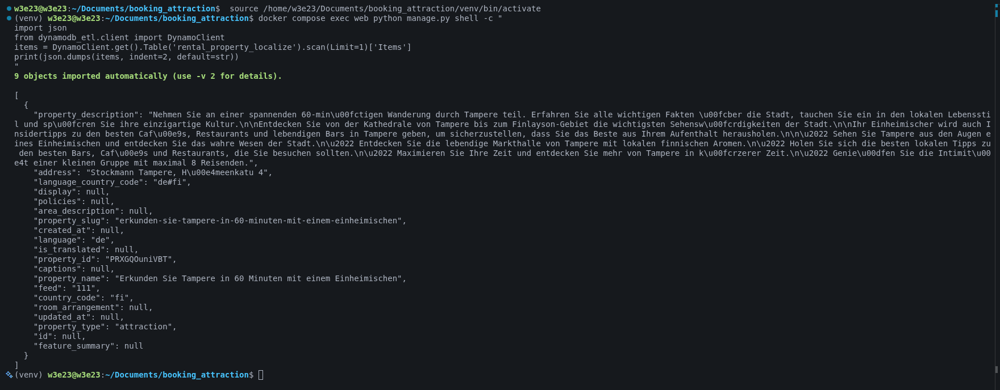 |
| `property_image_meta` | 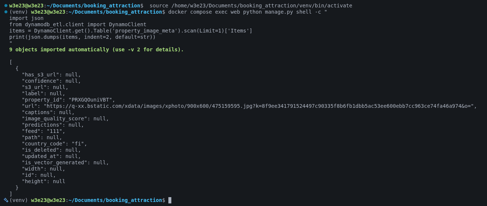 |
| `property_reviews` | 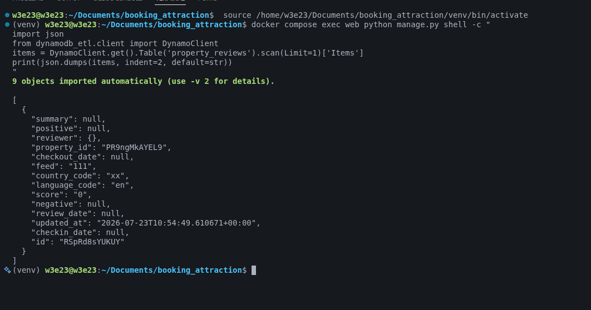 |
| `price_history` | 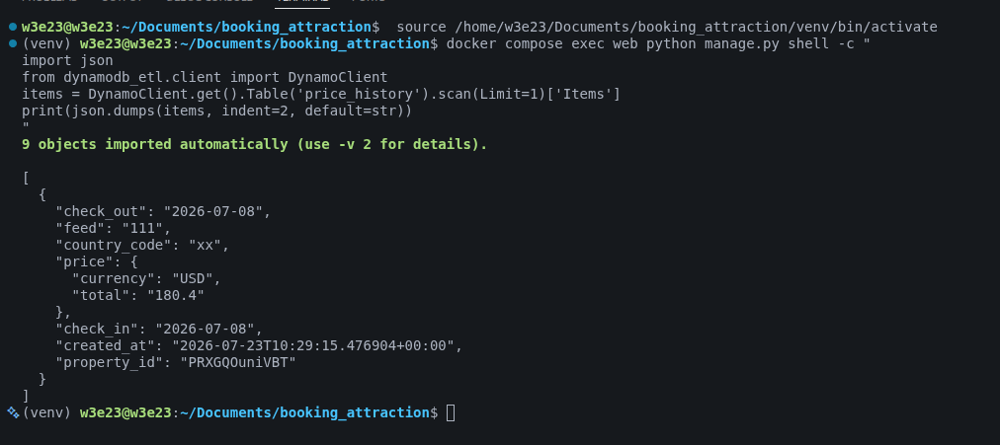 |
| `skip_properties` | 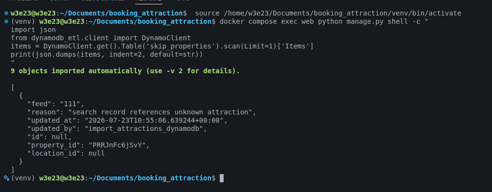 |


---

## Author

Author: Md Sabbir Hosen